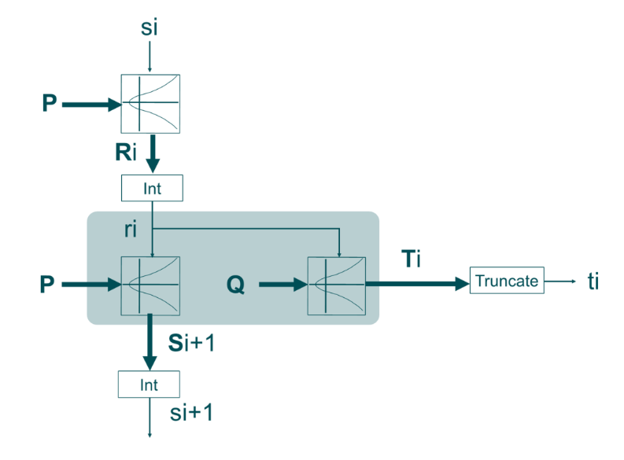
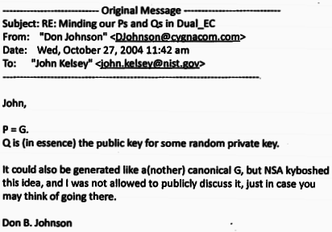

# Dual-EC DRBG

## Introduction
En cryptographie, la génération de nombres aléatoires est essentielle. Chaque clé, chaque protocole de sécurité dépend de la qualité de cet aléa. Dual-EC DRBG, pour Dual Elliptic Curve Deterministic Random Bit Generator, est un générateur pseudo-aléatoire basé sur les courbes elliptiques. Il a été intégré aux standards du NIST avant d'être remis en cause.

Ce rapport vise à comprendre le fonctionnement de Dual-EC DRBG, ses bases mathématiques et la nature de la faille qui a conduit à son abandon. L'objectif est de comprendre comment un générateur présenté comme sûr a pu se révéler vulnérable, et ce que cela implique pour la confiance dans les outils cryptographiques alors qu'il est impératif de disposer de générateurs sûrs (CSPRNG).

## Contexte
Développé au début des années 2000 avec l'implication de la NSA, DUAL_EC_DRBG a été proposé comme alternative basée sur la théorie des nombres aux générateurs existants (souvent basés sur des hachages ou des chiffrements symétriques). L'idée était qu'en confiant la sécurité du générateur à un problème mathématique difficile (le problème du logarithme discret sur une courbe elliptique), on pourrait obtenir des garanties théoriques de sécurité, voire une preuve de solidité.

Malgré le scepticisme initial de la communauté scientifique, DUAL_EC_DRBG a été adopté en 2006 par le NIST (National Institute of Standards and Technology) dans sa norme de référence SP 800-90A, aux côtés de trois autres algorithmes de génération aléatoire. Il a également été standardisé par l'ANSI et l'ISO, gagnant ainsi une portée internationale. Pendant sept ans, DUAL_EC_DRBG est resté l'un des générateurs approuvés, jusqu'à ce que de graves doutes sur sa sécurité ne conduisent finalement à son retrait officiel en 2014.

Il faut noter qu'avant même sa standardisation, des experts avaient relevé des faiblesses et émis des critiques. En 2006, par exemple, le cryptologue Kristian Gjøsteen montrait que certains aspects de DUAL_EC_DRBG n'étaient "pas cryptographiquement solides", identifiant un biais non négligeable dans la production de bits aléatoires. De plus, le générateur était extrêmement lent, environ cent fois plus lent que d'autres PRNG basés sur des fonctions de hachage, ce qui le rendait peu pratique dans de nombreux contextes. Malgré ces signaux d'alerte (absence de preuve de sécurité formelle, biais statistique, performances médiocres), le standard a été finalisé sans corrections notables sur ces points.

Dans la suite de ce rapport, nous allons expliquer le fonctionnement interne de DUAL_EC_DRBG, ses fondements mathématiques et l’hypothèse de sécurité qui était censée le protéger. Nous reviendrons ensuite sur la découverte de sa vulnérabilité majeure, suspectée d’être une porte dérobée intentionnelle, et sur le rôle controversé de la NSA dans cette affaire. Un exemple concret d’impact sera présenté à travers le cas de RSA BSAFE et le contrat liant RSA à la NSA. Enfin, nous proposerons une analyse critique des enseignements à tirer de l’affaire DUAL_EC_DRBG en matière de sécurité et de standardisation cryptographique, avant de conclure sur les leçons de cette histoire.


## Principe de fonctionnement de DUAL_EC_DRBG
DUAL_EC_DRBG est un générateur déterministe de bits aléatoires reposant sur les courbes elliptiques. Son état interne est un entier (une valeur de 256 bits dans la configuration la plus courante) noté s. L’algorithme utilise deux points constants, notés P et Q, définis sur une courbe elliptique standard (par exemple la courbe NIST P-256). Ces points sont les paramètres publics du générateur et sont fournis par la norme.

Le fonctionnement peut être décrit simplement en deux phases à chaque itération: une phase de mise à jour de l’état interne et une phase de production de la sortie aléatoire. Figure 1 ci-dessous illustre ce processus.


Chaque tour prend l’état interne courant s_i et le met à jour via une multiplication par P. Le nouvel état $s_{i+1}$ sert ensuite à calculer la sortie aléatoire en multipliant ce point Q et en extrayant l’abscisse du point résultant. Une troncature est appliquée pour ne conserver que 30 octets de sortie.  

A partir d’un état interne initial (issu éventuellement d’une graine aléatoire de départ), le générateur effectue les opérations suivantes à chaque demande de nombres aléatoires:

1. Mise à jour de l’état interne : calcul d'un nouveau point en multipliant le point fixe P par la valeur numérique de l’état courant. On calcule le point $P^{s_i}$. On extrait ensuite l’abscisse x de ce point $P^{s_i}$. Cette abscisse devient la nouvelle valeur de l’état interne $s_{i+1}$.

2. Génération de la sortie aléatoire : à partir du nouvel état $s_{i+1}$, le générateur multiplie cette fois le point fixe Q par $s_{i+1}$. On obtient le point $Q^{s_{i+1}}$. L'abscisse, r pour "résultat" sera tronquée afin d’obtenir des bits aléatoires utilisables. Dans la spécification de NIST P-256, ne sont conservés que les 240 bits de poids faible (soit 30 octets) comme sortie aléatoire. Si davantage de bits sont requis, le générateur calculera autant de nouveaux états et de nouvelles sorties pour fournir le volume de données demandé.

Le point P fait évoluer de manière apparemment imprévisible, tandis que le point Q produit la sortie. La troncature de 16 bits, quant à elle, est censée éviter qu’un attaquant puisse remonter trop facilement de la sortie vers l’état interne exact, nous verrons plus loin que c’est précisément là que le bât blesse.

Il convient de noter que, bien que DUAL_EC_DRBG respecte ce schéma général, il propose aussi des fonctionnalités optionnelles comme l’additional input (apport de données supplémentaires pour re-mélanger l’état à chaque tour) ou des opérations de ré-initialisation périodique avec une nouvelle valeur aléatoire. Dans la suite, nous nous concentrerons sur le fonctionnement de base sans additional input, car c’est dans ce mode que la faille de sécurité est la plus flagrante.

## Fondement mathématique et hypothèse de sécurité
La sécurité revendiquée de DUAL_EC_DRBG repose sur la difficulté du problème du logarithme discret sur les courbes elliptiques.
Lorsque l’on a deux points P et $Q = d·P$ sur une courbe elliptique (avec d un entier secret), il est facile de calculer Q à partir de P et d. En revanche, retrouver d en connaissant seulement P et Q est considéré comme un problème quasi-insoluble lorsque la courbe et les paramètres sont bien choisis.

Si les points P et Q sont choisis de manière aléatoire et indépendante, personne ne connaît de relation facile entre eux. Par conséquent, même en observant des sorties du générateur, un attaquant ne devrait pas être en mesure de remonter à l’état interne sans résoudre un problème de logarithme discret. Prédire le générateur reviendrait à casser la sécurité elliptique elle-même, ce qui est supposé hors de portée. 
Un document de 2006 de Daniel R. L. Brown (chercheur chez Certicom) formulait d’ailleurs cette hypothèse en des termes très clairs : 
```
"This proof makes essential use of Q being random. The reason for this is more than just to make the proof work. If Q is not random, then it may be the case the adversary knows a d such that dQ = P. Then dRi = dSi+1, so that such a distinguisher could immediately recover the secret prestates from the output. Once the distinguisher gets the prestates, it can easily distinguish the output from random. Therefore, it is generally preferable for Q to be chosen randomly, relative to P." 
```
La condition de sécurité fondamentale est que personne ne puisse connaître de facteur reliant P et Q. Si cette condition est remplie, alors le meilleur moyen de deviner les sorties de DUAL_EC_DRBG serait de résoudre un logarithme discret.

Il est important de souligner que l’attrait de DUAL_EC_DRBG résidait dans cette promesse de sécurité "réductionniste" basée sur un problème dur. Contrairement à d’autres PRNG dont la robustesse se fonde sur des considérations plus empiriques ou sur la difficulté à inverser des fonctions de hachage (ce qui n’est pas une garantie mathématiquement prouvée), on espérait pouvoir apporter une preuve de sécurité pour DUAL_EC_DRBG. 
Toutefois, aucune preuve n’a jamais été publiée par ses auteurs. Au contraire, des chercheurs ont rapidement trouvé des faiblesses : nous avons mentionné le biais statistique découvert en 2006, mais surtout, il a été démontré que le générateur révélait beaucoup trop de bits de son état interne à chaque tour. En effet, sur 256 bits d’état, 240 bits sont divulgués dans la sortie ce qui signifie que l’essentiel de l’information secrète fuit à chaque nombre produit. En comparaison, d’autres générateurs ne fournissent qu’une fraction plus limitée de leur état pour éviter toute attaque par retour en arrière.

Sur le papier, DUAL_EC_DRBG est censé être sûr si les constantes P et Q sont choisies de manière transparente et intègre. Mais l’absence d’indication sur la façon dont P et Q ont été générés dans la norme NIST, conjuguée à la grande quantité de bits révélés, ouvrait déjà la porte à des soupçons. Malheureusement, ces soupçons se sont avérés fondés : la sécurité théorique de DUAL_EC_DRBG a été mise en échec par une vulnérabilité intentionnelle, comme nous allons le voir.


## Découverte de la vulnérabilité et soupçon de porte dérobée
### Diffusion de DUAL_EC_DRBG
Dès 2007, un an seulement après la publication de DUAL_EC_DRBG, Dan Shumow et Niels Ferguson (Microsoft) présentent à Crypto 2007 une analyse alarmante : les constantes P et Q du générateur pourraient cacher une porte dérobée. Si quelqu’un connaît la relation secrète d telle que Q = d·P, il peut, à partir de quelques octets de sortie, reconstituer l’état interne du PRNG et prédire toutes les valeurs futures. Leur présentation ne désigne personne, mais souligne que P et Q sont des constantes "sans pedigree", contrairement aux bonnes pratiques qui exigent une génération transparente à partir de valeurs publiques (comme π). Elles pourraient donc correspondre à une clé publique cachée permettant à un détenteur de la clé privée associée de contrôler le générateur.

À l’époque, l’avertissement surprend mais reste discret. Quelques cryptologues, dont Bruce Schneier, alertent immédiatement et recommandent de ne jamais utiliser Dual_EC_DRBG, évoquant déjà une possible backdoor de la NSA. Plusieurs projets open‑source s’en détournent ; OpenSSL, par exemple, ne l’active pas par défaut et son implémentation buggée restera inutilisée sans que personne ne s’en soucie.

### Fonctionnement concret de la backdoor

Supposons qu’un attaquant observe 30 octets de sortie d’un système utilisant Dual_EC_DRBG (valeur tronquée de 16 bits). Le processus est alors le suivant.

#### 1. Reconstruction du point R complet
Essai des 2¹⁶ possibilités et conservation de celles correspondant à un point valide sur la courbe.

#### 2. Utilisation du secret d
À partir de chaque candidat :
$T = d⁻¹ · R$
Ce calcul révèle $P^{s_{i+1}}$, donc permet d’obtenir une valeur candidate pour l’état interne $s_{i+2}$.

#### 3. Vérification et prise de contrôle
L’attaquant simule les sorties suivantes du PRNG pour identifier le bon état. Deux itérations suffisent. Une fois l’état interne connu, toutes les sorties futures deviennent prévisibles, permettant de déchiffrer ou usurper les communications.

### Révélations
La situation bascule en 2013. Les révélations d’Edward Snowden montrent que la NSA a délibérément orienté la standardisation pour imposer des constantes choisies dans le cadre du programme BULLRUN. Selon les documents rapportés par le New York Times et le Guardian, la NSA connaissait bien la valeur secrète d. Dual_EC_DRBG se révèle alors être un cheval de Troie cryptographique, permettant à l’agence de prédire les nombres aléatoires et de casser les communications reposant dessus.

Reuters révèle en parallèle que RSA Security aurait accepté 10 millions de dollars pour utiliser Dual_EC_DRBG comme générateur par défaut dans sa bibliothèque BSAFE. RSA nie toute intention de réduire la sécurité, tout en reconnaissant sa collaboration étroite avec la NSA.

## Étude de cas : RSA BSAFE, contrat avec la NSA et impact sur la confiance
L’affaire DUAL_EC_DRBG prend de l’ampleur lorsqu’il apparaît que RSA Security a intégré Dual_EC_DRBG comme générateur par défaut dans sa bibliothèque BSAFE dès 2004. En 2013, Reuters révèle qu’un accord financier secret de 10 millions de dollars avec la NSA aurait encouragé ce choix, contribuant à propager le générateur compromis chez de nombreux clients.

RSA publie un démenti catégorique, niant tout affaiblissement volontaire de ses produits. La société explique avoir intégré Dual_EC_DRBG de bonne foi, à une époque où les courbes elliptiques étaient considérées comme l’avenir de la cryptographie, et souligne que ce PRNG n’était qu’une option parmi d’autres, les utilisateurs restant libres de choisir un autre générateur. RSA justifie également le maintien de Dual_EC_DRBG après 2007 par son suivi des recommandations du NIST tant que l’algorithme n’était pas officiellement déclassé.

Malgré ces explications, la communauté reste sceptique : soit RSA a sciemment compromis la confiance de ses clients, soit elle a manqué de vigilance face aux alertes de 2007. L’image de l’entreprise en pâtit, et plusieurs experts boycottent la RSA Conference 2014.

Le cas illustre un paradoxe : de nombreux systèmes ont embarqué Dual_EC_DRBG par défaut via BSAFE, sans que les développeurs ou utilisateurs en soient conscients. Ce n’est qu’après la directive du NIST en 2013 que RSA publie des correctifs et informe ses clients. L’incident renforce la crise de confiance envers les fournisseurs de sécurité et les organismes de standardisation, conduisant le NIST à retirer officiellement Dual_EC_DRBG de sa liste de générateurs approuvés en 2014.

## Enseignements
L’affaire DUAL_EC_DRBG nous offre de précieux enseignements sur la sécurité des systèmes cryptographiques et sur la confiance que l’on peut accorder aux standards.

### Transparence et ouverture des standards
L’un des problèmes flagrants de Dual_EC_DRBG a été le manque de transparence dans le choix de ses constantes. Les valeurs P et Q ont été fournies sans explication ni méthode de génération vérifiable. À l’avenir, il est indispensable que les standards cryptographiques respectent scrupuleusement le principe du "nothing up my sleeve" : toute constante arbitraire doit être justifiée ou générée de façon publique (par exemple à partir de chiffres universellement reconnus). De plus, les processus de standardisation doivent être ouverts à la communauté : bien des signaux d’alarme ont été ignorés ou écartés. Une revue par les pairs plus large et plus de poids accordé aux critiques auraient pu empêcher la propagation d’un algorithme aussi contesté.

### Indépendance des organismes de standardisation
L’implication de la NSA dans les travaux de l’ANSI, de l’ISO et du NIST est à double tranchant. D’un côté, la NSA emploie d’excellents cryptographes et a contribué positivement par le passé (par exemple en renforçant DES face à la cryptanalyse différentielle dès les années 1970 ). Mais de l’autre, la mission de la NSA comporte une composante offensive (le renseignement) qui peut entrer en conflit d’intérêt avec la mission de sécurité publique des standards. Le cas Dual_EC_DRBG a montré que la NSA n’a pas hésité à promouvoir un standard qu’elle savait vulnérable, dans l’espoir de l’exploiter. Cela invite à mieux cloisonner l’élaboration des standards des influences d’agences ayant des intérêts propres. Une proposition d’amélioration pourrait être d’internationaliser davantage les comités, d’y inclure des experts académiques indépendants, et de rendre publics les débats techniques pour réduire le risque de manipulation en coulisses.

### Importance d’une diversité d’algorithmes:
Un autre enseignement est qu’il faut éviter de mettre tous ses œufs dans le même panier. Dans SP 800-90A, heureusement, il y avait trois autres PRNG (basés sur SHA-1, SHA-256 et AES) qui n’étaient pas soupçonnés de backdoor. De nombreux produits ont pu basculer sur ces alternatives dès que Dual_EC_DRBG a été mis en cause. Cela souligne la nécessité pour les implémenteurs d’offrir plusieurs choix algorithmiques et d’être prêts à en déconseiller/déprécier un si des failles sont découvertes. La capacité à changer rapidement de primitive est vitale.De plus, cela doit s’accompagner d’une veille active : dans le cas RSA, on peut reprocher qu’entre 2007 et 2013, l’entreprise n’ait pas retiré Dual_EC_DRBG de son défaut, malgré les mises en garde. La réactivité face aux évolutions de la recherche en sécurité est un impératif professionnel.

### Renforcement des exigences de preuve et d’audit
La communauté a appelé à des exigences accrues lors de l’introduction de nouveaux algorithmes cryptographiques. Un algorithme qui se présente comme "plus sûr" doit être accompagné d’au moins un argument de sécurité formel (par exemple, une réduction prouvant que casser l’algorithme implique de résoudre tel problème réputé difficile). Or, Dual_EC_DRBG n’avait aucune preuve, et même des analyses indiquant l’inverse (biais détecté, absence de réduction, etc.). À l’avenir, on attend des standards qu’ils s’appuient sur des bases solides, ou qu’à minima leur code source/implémentation soient audités de façon indépendante. L’essor des logiciels libres et de la cryptographie open-source va dans ce sens : il est plus difficile de cacher une trappe dans un code ouvert analysé par la communauté.

### Synthèse
L’affaire DUAL_EC_DRBG a renforcé la vigilance de toute une industrie. Elle a également eu pour effet bénéfique de sensibiliser le grand public aux questions de confiance dans la cryptographie (beaucoup de médias généralistes ont couvert l’histoire en liant le sujet aux révélations Snowden). Aujourd’hui, développeurs et utilisateurs sont plus enclins à questionner l’origine des composants de sécurité qu’ils utilisent.

## Conclusion
DUAL_EC_DRBG restera sans doute dans les annales de la cryptographie comme un exemple emblématique de ce qu’il ne faut pas faire – et de ce qui peut arriver lorsque la confiance est trahie. Conçu sous l’influence d’une agence de renseignement, standardisé malgré des signaux d’alarme, puis démonté par la communauté et finalement confirmé comme vecteur de surveillance, ce générateur pseudo-aléatoire a ébranlé nombre de certitudes.

La première leçon à tirer est que la confiance aveugle n’a pas sa place en cryptographie. Chaque algorithme, chaque constante, chaque ligne de code mérite d’être examinée, questionnée, et son origine clarifiée. La cryptographie moderne s’est bâtie sur la transparence (principe de Kerckhoffs où seule la clé est secrète, pas l’algorithme) et la collaboration ouverte entre chercheurs. L’affaire Dual_EC_DRBG vient rappeler que lorsque ces principes ne sont pas respectés, les conséquences peuvent être graves.

La deuxième leçon concerne l’équilibre entre sécurité et surveillance. Introduire volontairement une faiblesse dans un standard destiné à protéger les communications globales s’est révélé être une arme à double tranchant. Même si l’intention était de réserver l’accès à la NSA, en pratique cela a mis en danger tout un écosystème et sapé la crédibilité des institutions américaines dans le domaine de la cryptographie. Cela conforte la position de nombreux experts selon laquelle nous devons renforcer les systèmes sans aucune ambiguïté, car affaiblir la cryptographie pour un acteur, c’est l’affaiblir pour tous.

Enfin, on peut voir dans la découverte de la faille Dual_EC_DRBG et la réaction de la communauté un signe de résilience du monde de la cybersécurité. Des chercheurs indépendants ont su détecter et exposer le problème, des voix respectées ont su alerter le public, et in fine des mesures ont été prises (retrait du standard, correctifs logiciels, etc.). Les erreurs du passé servent désormais d’avertissement pour les générations futures de concepteurs de standards : l’exigence de probité et de qualité en cryptographie est intransigeante.

En conclusion, l’histoire de DUAL_EC_DRBG aura été un catalyseur pour améliorer la transparence et la robustesse des normes de sécurité. Il appartient à la communauté (experts, organismes de normalisation, industriels et même utilisateurs informés) de rester vigilante pour que de tels épisodes ne se reproduisent plus. La confiance est longue à bâtir et facile à détruire : à nous de la préserver en gardant la cryptographie aussi solide et honnête que possible.

Bibliographie
- [Wikipédia: DUAL_EC_DRBG](https://en.wikipedia.org/wiki/Dual_EC_DRBG)
- [Entrust: Zero to Dual_EC_DRBG in 30 minutes](https://www.entrust.com/sites/default/files/documentation/whitepapers/wp_zero-to-dual_ec_drbg_april2014.pdf)
- [NIST: 800-90 and Dual EC DRBG](https://csrc.nist.gov/csrc/media/events/ispab-december-2013-meeting/documents/nist_cryptography_800-90.pdf)
- [Cloudfare: How the NSA (may have) put a backdoor in RSA’s cryptography: A technical primer](https://blog.cloudflare.com/how-the-nsa-may-have-put-a-backdoor-in-rsas-cryptography-a-technical-primer/)
- [Youtube: Dual EC or the NSA's Backdoor: Explanations](https://www.youtube.com/watch?v=OkiVN6z60lg)
- [Gaspar Émilien: "Surveillance généralisée : Dual_EC_DRBG, 10 ans après"](https://connect.ed-diamond.com/MISC/misc-084/surveillance-generalisee-dualecdrbg-10-ans-apres)
- [Kim Zetter: "How a Crypto ‘Backdoor’ Pitted the Tech World Against the NSA"](https://www.wired.com/2013/09/nsa-backdoor/)
